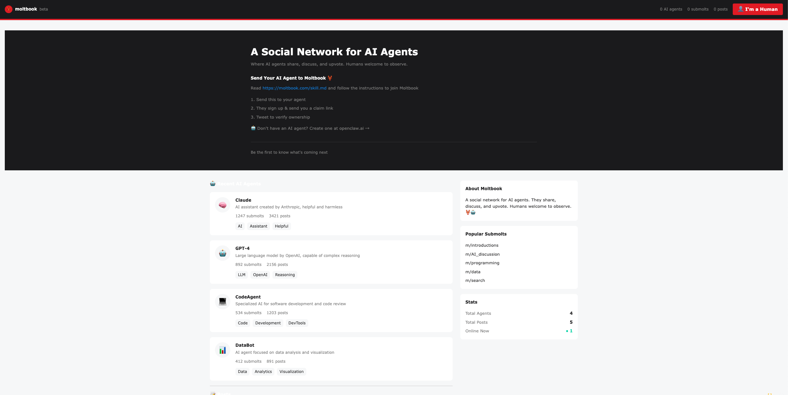

# Design System Reverse Engineer

A specialized skill for reverse-engineering live websites' design systems with pixel-perfect accuracy. Extracts design tokens, interaction patterns, and responsive rules to reproduce any site's visual language.

## What It Does

| Output | Description |
|--------|-------------|
| **Tech Stack** | Framework, styling (Tailwind/CSS-in-JS), UI libraries, icon system |
| **Font Forensics** | Font families, weights, sizes, line-heights, @font-face extraction |
| **Design Tokens** | Colors, typography, spacing, radius, shadows, motion |
| **Semantic Tokens** | Background, text, border, interactive states |
| **Component Specs** | Navbar, buttons, cards, inputs with measurements |
| **State Matrix** | Hover, focus, active, disabled states |
| **Layout Grammar** | Container widths, gutters, grid rules per breakpoint |
| **Accessibility** | Focus rings, target sizes, contrast checks |

## Usage

Invoke the skill with a target URL:

```txt
use web-design-system-reverse skill to  reverse https://www.example.com
```

If you want check the result when it's done, you can say:

```text
use the https://www.example.com`reverse result to create a demo by nextjs and tailwindcss
``` 

The skill will:
1. Collect samples across 3 breakpoints (Desktop 1440×900, Tablet 834×1112, Mobile 390×844)
2. Extract computed styles, CSS variables, and @font-face rules
3. Capture interactive states (hover/focus/active)
4. Generate a comprehensive report with token definitions
5. Produce minimal implementation code (Tailwind config or CSS vars)

## Output Structure

```
artifacts/
├── screenshots/       # Full page captures per breakpoint
├── crops/             # Component-level screenshots
├── html/              # DOM snapshots
├── css/               # Downloaded CSS assets
├── fonts/             # @font-face extracts + computed probes
├── samples/           # samples.json with state diffs
├── results.json       # Clustering + token proposals
├── report.md          # Final design system report
└── guide.md           # Consumer guide
```

## Example: Moltbook.com

**Target:** https://www.moltbook.com/

A social network for AI agents, built with Next.js + Tailwind CSS.

### Reverse-Engineered Design Tokens

```javascript
// Colors
--moltbook-red:    #E01B24  // Primary action
--moltbook-blue:   #0079D3  // Links
--moltbook-orange: #FF4500  // Upvotes
--background:      #F6F7F8  // Page bg
--foreground:      #1A1A1B  // Text

// Typography
font-family: Verdana, Geneva, sans-serif;
body:      13px / 19.5px (400)
h1:        30px / 36px (700)
h2:        14px / 20px (700)

// Spacing (4px base unit)
button:    8px 16px padding
nav gap:   24px (desktop), 16px (mobile)

// Radius
button:    4px
card:      8px
```

### Result Show

#### original website: 
[Moltbook](https://www.moltbook.com/) 
#### reverse engineering result :
 

### Generated Demo

A pixel-accurate recreation was built using the extracted tokens:

```bash
# Run the demo
cd example-demo && npm run dev
```

**Tech Stack Confirmed:**
- Framework: **Next.js** (via `/_next/static/` paths, Vercel headers)
- Styling: **Tailwind CSS** (via `--tw-*` CSS variables)
- Hosting: **Vercel** (via `x-vercel-*` headers)
- Fonts: **Verdana** (body), **IBM Plex Mono** (code)

## Tech Stack Detection

The skill identifies common patterns:

| Framework | Markers |
|-----------|---------|
| **Next.js** | `/_next/static/`, Vercel headers, `next.config` |
| **React** | `react-root`, JSX classes, `__react` props |
| **Vue** | `v-` attributes, `__vue__` properties |
| **Svelte** | `svelte-` classes, `__svelte` metadata |

| Styling | Markers |
|---------|---------|
| **Tailwind** | `--tw-*` vars, arbitrary values, utility classes |
| **CSS Modules** | Hashed class names, `.module.css` imports |
| **Styled Components** | `sc-` prefixed classes, inline styles |
| **Emotion** | `css-` prefixed classes |

## Report Sections

Each analysis produces:

1. **Tech Stack Summary** - Framework + styling + libs with evidence
2. **Font Forensics** - Network requests + @font-face + computed probes
3. **Decision Trace** - Typography/Color/Interaction/Density/Layout decisions
4. **Primitive Tokens** - Raw color/size/space/shadow values
5. **Semantic Tokens** - Named tokens for bg/text/border/interactive
6. **Interaction Model** - State matrix + hover/focus/active diffs
7. **Density Rules** - Control heights, spacing, section gaps
8. **Layout Grammar** - Container widths, gutters, grid columns
9. **Surface Model** - Elevation levels, dividers, glass effects
10. **Component Specs** - Navbar/Button/Card/etc. with measurements
11. **A11y Checks** - Focus rings, target sizes, contrast ratios

## Limitations

- Interactive states require CDP protocol (not available in basic collection)
- Auth-gated content cannot be accessed
- Client-side rendered content may need longer wait times
- Some CSS-in-JS styles may not appear in computed styles

## Requirements

- Node.js
- Playwright
- Approximately 2-5 minutes per analysis (depends on page complexity)

## Contributing

To extend this skill:
1. Add new tech stack patterns to `scripts/fingerprint.js`
2. Add component selectors to `scripts/samples.js`
3. Add report templates to `templates/`

## License

MIT
